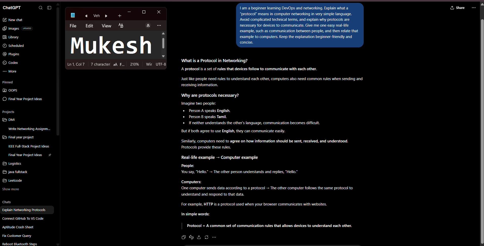
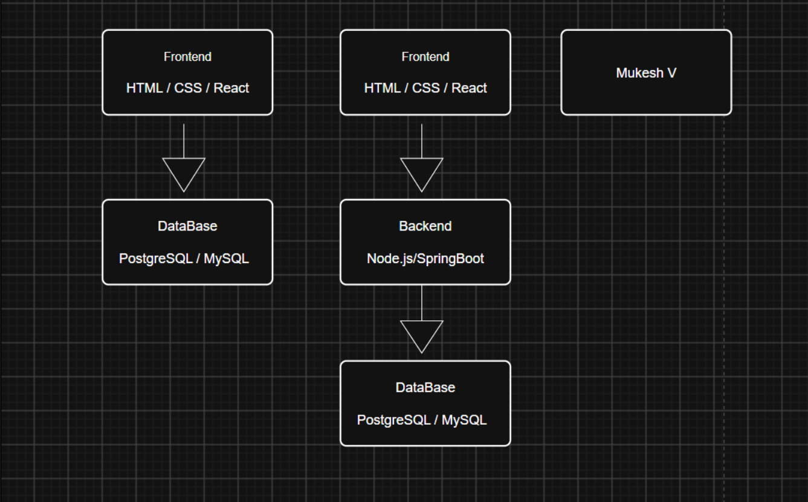
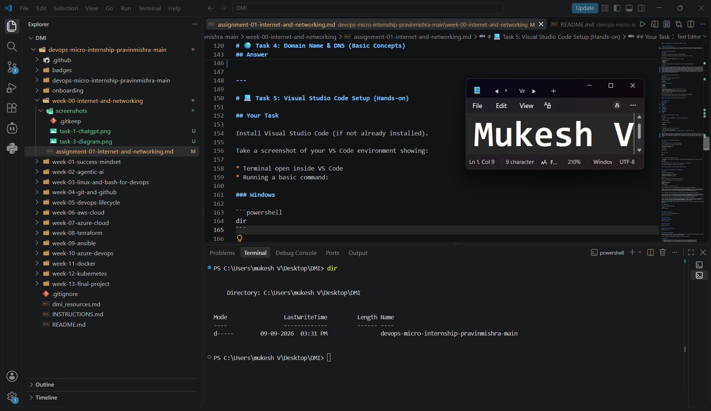

# Week 00 - Internet and Networking

Part of the DevOps Micro Internship (DMI) Cohort 3 with Agentic AI

---

# 🧑‍💻 Task 1: Using ChatGPT as Your Learning Assistant

## Scenario

You're new to DevOps and will frequently encounter technical questions. ChatGPT can be your learning companion.

## Your Task

Write a clear ChatGPT prompt to help you understand:

> "What is a protocol in networking? Explain with a simple real-life example."

Take a screenshot of your interaction showing:

* Your detailed prompt (with clear expectations)

* ChatGPT's simplified response with an example

## Screenshot

Save your screenshot in the `screenshots` folder and update the file name below.




Replace `task-1-chatgpt.png` with your actual screenshot file name.

---

## What I Learned (2–3 lines)

I learned that a networking protocol is a set of rules that devices follow to communicate with each other. The real-life example helped me understand why both sides need to follow the same rules to exchange information correctly.

---

# 🌐 Task 2: Internet and Networking

## Scenario

Your friend is launching an online bookstore named **EpicReads**.

He asked you to explain how users globally can access his website hosted in Finland.

## Your Task

Write a short explanation (**100–150 words**) that includes:

* Packet Switching

* IP Address

* TCP/IP

* HTTP/HTTPS

💡 **Tip:** You may use ChatGPT (as demonstrated in Task 1) to refine your explanation.

## Answer

When a user anywhere in the world visits EpicReads, the request travels across the Internet to the server hosted in Finland. The data is divided into small pieces called packets, and **packet switching** allows these packets to travel through different network paths before reaching the destination. The server has an **IP address**, which identifies where the website is hosted. **TCP/IP** provides the basic communication rules for delivering the packets reliably between the user's device and the server. Once the request reaches the EpicReads server, **HTTP or HTTPS** is used to communicate between the user's browser and the website. HTTPS is preferred because it encrypts the communication and protects sensitive information such as login credentials and payment details. The response is then sent back to the user through the Internet.

---

# 🏗️ Task 3: Application Architecture & Stack

## Scenario

EpicReads bookstore has two application versions:

### Two-Tier Application

* Frontend

* Database

### Three-Tier Application

* Frontend

* Backend

* Database

## Your Task

* Draw simple diagrams (hand-drawn or tool-based such as draw.io)

* Label each layer clearly

* List at least two common technologies or tools used for each layer

* Submit a screenshot or photo clearly showing your own drawing

## Diagram Screenshot / Photo

Save your diagram image in the `screenshots` folder and update the file name below.




Replace `task-3-diagram.png` with your actual diagram file name.

---

## Technologies Used

### Frontend

* HTML / CSS

* React

### Backend

* Node.js

* Spring Boot

### Database

* PostgreSQL

* MySQL

---

# 🌍 Task 4: Domain Name & DNS (Basic Concepts)

## Scenario

Your friend's bookstore **EpicReads** is currently accessible through:

```text

52.172.142.222:3000

```

He purchased the domain:

```text

epicreads.com

```

## Your Task

In **50–100 words**, explain in your own words:

1. What is DNS (Domain Name System)?

2. Which DNS record type should be used to connect the domain to the given IP, and why?

## Answer

DNS (Domain Name System) converts human-readable domain names into IP addresses that computers can use to locate servers. Instead of remembering an address such as `52.172.142.222`, users can simply enter `epicreads.com` in their browser. An **A record** should be used because it maps a domain name to an IPv4 address. Therefore, the A record for `epicreads.com` can point to `52.172.142.222`. The `:3000` part is a port number, not part of the IP address or DNS A record.


---

# 💻 Task 5: Visual Studio Code Setup (Hands-on)

## Your Task

Install Visual Studio Code (if not already installed).

Take a screenshot of your VS Code environment showing:

* Terminal open inside VS Code

* Running a basic command:

### Windows

```powershell

dir

```

### Linux / macOS

```bash

pwd

ls

```

* Your selected VS Code theme clearly visible

⚠️ **Important:** The screenshot must show your username or another identifiable detail to confirm it is your environment.

## Screenshot

Save your screenshot in the `screenshots` folder and update the file name below.




Replace `task-5-vscode.png` with your actual screenshot file name.

---

# 🔗 Task 6: Publish Your Assignment as a LinkedIn Post

## Objective

Publishing on LinkedIn helps you:

* Build your professional online presence

* Reinforce your learning

* Document your DevOps journey publicly

## Your Task

Summarize your answers from Tasks 1–5 into a LinkedIn post.

Clearly structure your post into the following sections:

* ChatGPT

* Internet & Networking

* App Architecture

* DNS

* VS Code Setup

Use the credit note that matches your track:

Add the following credit note at the end of your post **(If you are DMI Cohort 3 student)**:

> **P.S. This post is part of the DevOps Micro Internship (DMI) with Agentic AI — Cohort 3 — by Pravin Mishra. My graded progress is public: https://dmi.pravinmishra.com/s/YOUR-GITHUB-USERNAME.html · Start your DevOps journey: https://dmi.pravinmishra.com/?utm_source=student&utm_medium=ps-linkedin&utm_campaign=cohort3**


Add the following credit note at the end of your post **(If you are DMI Self-paced track student)**:

> **P.S. This post is part of the DevOps Micro Internship (DMI) — Self-Paced Engineer Track — by Pravin Mishra. My graded progress is public: https://dmi.pravinmishra.com/s/YOUR-GITHUB-USERNAME.html · Start your DevOps journey: https://dmi.pravinmishra.com/?utm_source=student&utm_medium=ps-linkedin&utm_campaign=self-paced**

Add the following credit note at the end of your post **(If you are DMI Campus student)**:

> **P.S. This post is part of the DevOps Micro Internship (DMI) — Campus — by Pravin Mishra. My graded progress is public: https://dmi.pravinmishra.com/s/YOUR-GITHUB-USERNAME.html · Start your DevOps journey: https://dmi.pravinmishra.com/?utm_source=student&utm_medium=ps-linkedin&utm_campaign=campus**

Replace `YOUR-GITHUB-USERNAME` with your GitHub username — that link is your public DMI progress page (your graded badge page).

---

## LinkedIn Post URL

Paste your LinkedIn post URL here:

```

https://www.linkedin.com/posts/mukesh5164_dmi-devops-micro-internship-with-agentic-share-7503438584788688896-zIGu/?utm_source=share&utm_medium=member_desktop&rcm=ACoAAEa7A7EBeY-5ffT7tJDSjl81YX0SP5rMgco

```

---

## LinkedIn Post Backup Copy

Paste the full text of your LinkedIn post here:

🚀 Week 0 of my DevOps journey is complete!

As part of the **DevOps Micro Internship (DMI) — Cohort 3 with Agentic AI**, I worked through the fundamentals of Internet, Networking, Application Architecture, DNS, and VS Code.

💬 **ChatGPT**

I explored how ChatGPT can be used as a learning assistant and learned what networking protocols are through simple real-life examples.

🌐 **Internet & Networking**

I learned the basics of packet switching, IP addresses, TCP/IP, and HTTP/HTTPS, and how these technologies work together when accessing a website hosted on a remote server.

🏗️ **App Architecture**

I learned the difference between two-tier and three-tier architectures and explored common technologies used for frontend, backend, and database layers.

🌍 **DNS**

I learned how DNS translates human-readable domain names into IP addresses and why an A record is used to map a domain to an IPv4 address.

💻 **VS Code Setup**

I configured my VS Code environment, opened the integrated terminal, and practiced basic command-line operations.

This week gave me a stronger foundation for understanding how applications communicate and how modern software systems are structured.

Looking forward to building more hands-on DevOps skills in the coming weeks. 🚀

#DevOps #DMI #DevOpsMicroInternship #Networking #Cloud #Linux #VSCode #LearningInPublic #AgenticAI

P.S. This post is part of the DevOps Micro Internship (DMI) with Agentic AI — Cohort 3 — by Pravin Mishra. My graded progress is public: https://dmi.pravinmishra.com/s/YOUR-GITHUB-USERNAME.html · Start your DevOps journey: https://dmi.pravinmishra.com/?utm_source=student&utm_medium=ps-linkedin&utm_campaign=cohort3


---

# Reflection – Week 0

### What did you find easy?

The basic networking concepts such as IP addresses, DNS, HTTP/HTTPS, and application architecture were relatively easy to understand after connecting them with real-world examples.

---

### What was difficult?

Understanding how different networking concepts work together was initially confusing, especially packet switching, TCP/IP, DNS, and ports. I also needed practice to understand the difference between two-tier and three-tier architecture.

---

### What will you improve next week?

Next week, I want to focus more on hands-on practice instead of only learning concepts. I will improve my command-line skills and start understanding how DevOps tools and workflows are used in real projects.

---

## 📌 About DMI & CloudAdvisory

DevOps Micro Internship (DMI) is a project-based DevOps program run by Pravin Mishra (The CloudAdvisory) focused on real-world execution, systems thinking, and career readiness.

It helps learners build strong DevOps foundations with hands-on experience.


## 📌 Resources

- 🌐 **DMI Official Website:** https://dmi.pravinmishra.com?utm_source=github&utm_medium=readme  

- 🎓 **University:** https://university.pravinmishra.com?utm_source=github&utm_medium=readme  

- 💬 **Discord Community:** https://discord.pravinmishra.com?utm_source=github&utm_medium=readme  

- 📝 **Blog:** https://dmi.pravinmishra.com/blog?utm_source=github&utm_medium=readme  

- ▶️ **YouTube Playlist (DMI Cohort 3):** https://www.youtube.com/playlist?list=PLFeSNDtI4Cho  

- 🔗 **Pravin Mishra (LinkedIn):** https://www.linkedin.com/in/pravin-mishra-aws-trainer/  

- 🏢 **CloudAdvisory (LinkedIn):** https://www.linkedin.com/company/thecloudadvisory/

---

*This submission is part of DevOps Micro Internship (DMI) Cohort 3 — Agentic AI Track*